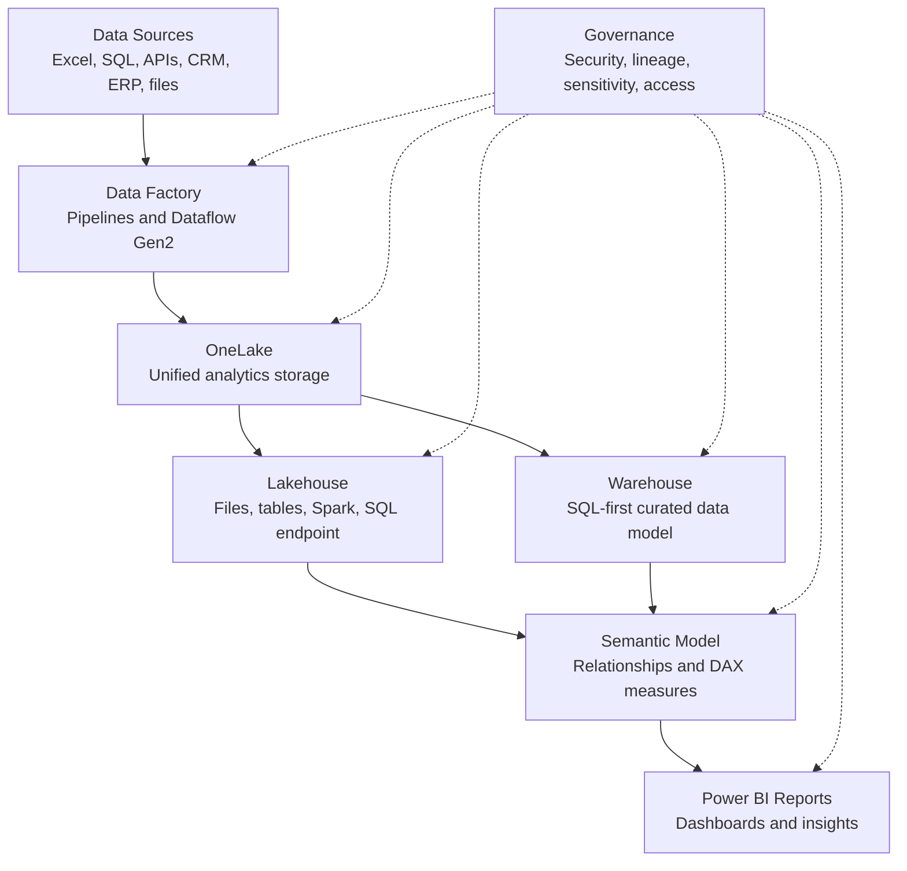
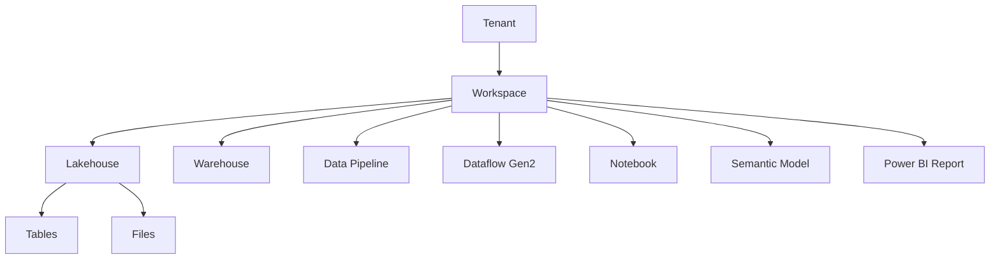
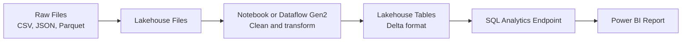
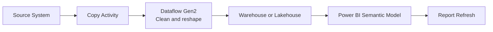
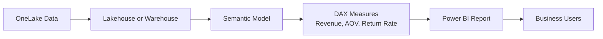
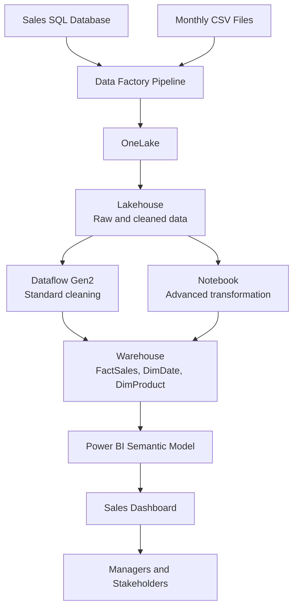

# Microsoft Fabric Learning Note

## 🧭 Overview

Microsoft Fabric is an end-to-end analytics platform from Microsoft. It brings together data integration, data engineering, data warehousing, real-time analytics, data science, and Power BI reporting in one SaaS platform.

For a junior data analyst, Fabric is important because it explains how modern companies move from raw data to trusted dashboards.

## 1. What Is Microsoft Fabric?

Microsoft Fabric is a unified data and analytics platform. Instead of using many separate tools for data pipelines, storage, transformation, SQL analytics, notebooks, semantic models, and reports, Fabric provides these experiences in one environment.

In simple terms:

> Microsoft Fabric is a single platform where teams can ingest data, store it, transform it, query it, model it, and report on it.

Fabric includes several workloads:

| Workload | Main Purpose | Common User |
| --- | --- | --- |
| Data Factory | Move and transform data | Analyst, data engineer |
| Data Engineering | Work with Lakehouses, Spark, and notebooks | Data engineer |
| Data Warehouse | SQL-based analytics and reporting models | Analyst, analytics engineer |
| Power BI | Reports, dashboards, semantic models | Data analyst |
| Real-Time Intelligence | Streaming and event data | Data engineer, analyst |
| Data Science | Machine learning and experiments | Data scientist |
| OneLake | Unified storage layer | Everyone using Fabric data |

## 2. Why Companies Use Fabric

Companies use Fabric because analytics work often becomes fragmented. Data may be stored in one system, cleaned in another, queried somewhere else, and finally reported in Power BI.

Fabric helps by providing:

| Reason | Business Value |
| --- | --- |
| One platform | Reduces tool switching and integration work |
| Centralised storage | Helps teams avoid duplicated data silos |
| Power BI integration | Makes reporting easier from curated Fabric data |
| Low-code and code-first tools | Supports both analysts and engineers |
| Governance | Helps manage access, ownership, lineage, and sensitivity |
| Scalability | Supports larger datasets than local Excel files |
| Collaboration | Teams can work in shared workspaces |

Example:

A sales team, finance team, and operations team can use shared curated data instead of each team maintaining separate spreadsheet extracts.

## 3. Difference Between Power BI Service and Fabric

Power BI Service is mainly for publishing, sharing, refreshing, and consuming Power BI reports and dashboards in the cloud.

Microsoft Fabric is broader. It includes Power BI, but also includes data engineering, Data Factory, Lakehouse, Warehouse, notebooks, OneLake, and other analytics workloads.

| Area | Power BI Service | Microsoft Fabric |
| --- | --- | --- |
| Main purpose | Report sharing and BI collaboration | End-to-end analytics platform |
| Scope | BI reports, dashboards, apps, semantic models | Data ingestion, storage, transformation, SQL, notebooks, BI |
| Typical user | Report creators and report consumers | Analysts, engineers, scientists, BI teams |
| Storage focus | Semantic models and report artifacts | OneLake for organisation-wide analytics data |
| Data preparation | Power Query, dataflows, semantic models | Dataflows Gen2, pipelines, notebooks, Lakehouse, Warehouse |
| Best for | Sharing insights | Building the full data-to-insight workflow |

Simple explanation:

> Power BI Service is one part of Fabric. Fabric is the bigger analytics platform around it.

## 4. Difference Between Fabric and Azure

Azure is Microsoft's full cloud computing platform. It includes many services for infrastructure, databases, storage, networking, application hosting, AI, security, and analytics.

Fabric is a SaaS analytics platform built for data and BI workflows. Fabric uses Azure technology underneath, such as Azure Data Lake Storage for OneLake, but Fabric hides much of the infrastructure management.

| Area | Azure | Microsoft Fabric |
| --- | --- | --- |
| Platform type | Broad cloud platform | Analytics SaaS platform |
| Scope | Compute, storage, networking, apps, databases, AI, security | Data integration, storage, analytics, BI |
| Setup | More infrastructure choices and configuration | More managed and guided |
| Users | Cloud engineers, developers, data engineers, architects | Analysts, BI developers, data engineers, data scientists |
| Example services | Azure Data Lake, Azure SQL, Azure Data Factory, Synapse | OneLake, Lakehouse, Warehouse, Data Factory, Power BI |
| Analyst view | Data may come from Azure services | Fabric is where data can be prepared and analysed |

Simple explanation:

> Azure is the wider cloud platform. Fabric is a managed analytics platform that runs on Microsoft cloud technology and is designed around data workflows.

## 5. Fabric Architecture

Fabric architecture can be understood as layers:

1. Data sources
2. Data ingestion and transformation
3. OneLake storage
4. Lakehouse or Warehouse analytical layer
5. Semantic model
6. Power BI reports and business users
7. Governance and security across the platform



### Fabric Item Hierarchy



## 6. OneLake

OneLake is the unified data lake for Microsoft Fabric. Every Fabric tenant has OneLake, and it acts as the central storage layer for analytics data.

For analysts, OneLake matters because it reduces the need to copy the same data into many places.

| Feature | Meaning |
| --- | --- |
| Unified storage | One logical data lake for the organisation |
| Built into Fabric | No separate data lake setup is needed for basic use |
| Works across workloads | Lakehouse, Warehouse, Power BI, notebooks, and other Fabric items can use it |
| Shortcuts | Reference data from other locations without copying it |
| Governance | Security and access policies can be applied consistently |

Simple explanation:

> OneLake is like OneDrive for analytics data, but for enterprise data workloads.

## 7. Lakehouse

A Lakehouse combines ideas from a data lake and a data warehouse.

It can store files and tables, support large-scale data engineering, and also allow SQL-style querying for analysis.

| Lakehouse Feature | Analyst-Friendly Meaning |
| --- | --- |
| Files area | Stores raw or semi-structured files such as CSV, JSON, or Parquet |
| Tables area | Stores structured Delta tables |
| Spark support | Allows large-scale transformations with notebooks |
| SQL analytics endpoint | Lets analysts query Lakehouse tables using SQL |
| Power BI integration | Lakehouse data can be used for reporting |

Use a Lakehouse when:

- Data is still being cleaned or explored.
- You need to store both files and tables.
- Data engineers are using Spark or notebooks.
- The team uses a medallion architecture such as bronze, silver, and gold layers.



## 8. Warehouse

The Fabric Warehouse is a SQL-first analytical database experience in Fabric. It is designed for structured reporting, dimensional models, curated business tables, and BI workloads.

| Warehouse Feature | Analyst-Friendly Meaning |
| --- | --- |
| T-SQL support | Analysts can write familiar SQL |
| Structured data | Best for clean tables used in reporting |
| Star schema support | Good for fact and dimension modelling |
| Power BI integration | Easy to build reports from curated warehouse tables |
| Governance | Works with Fabric security and permissions |

Use a Warehouse when:

- The data is structured and ready for reporting.
- The team prefers SQL over Spark.
- You are building fact and dimension tables.
- You need curated tables for Power BI semantic models.

### Lakehouse vs Warehouse

| Question | Lakehouse | Warehouse |
| --- | --- | --- |
| Main style | Data lake plus SQL access | SQL-first analytics |
| Best for | Raw, semi-structured, and transformed data | Curated reporting tables |
| Main users | Data engineers, data scientists, analysts | Analysts, BI developers, analytics engineers |
| Main tools | Spark, notebooks, SQL endpoint | T-SQL |
| Reporting use | Good for exploratory and prepared Delta tables | Strong for governed BI models |

## 9. Data Factory

Data Factory in Fabric is used for data integration. It helps connect to data sources, move data, transform data, and orchestrate workflows.

For junior analysts, Data Factory is useful to understand because many reports depend on scheduled data pipelines.

| Data Factory Component | Purpose |
| --- | --- |
| Pipeline | A workflow that runs activities in order |
| Copy activity | Moves data from source to destination |
| Dataflow Gen2 | Low-code data transformation using Power Query |
| Notebook activity | Runs a notebook as part of a workflow |
| Schedule | Runs a pipeline at a planned time |

Example:

A pipeline runs every morning, copies yesterday's sales data, transforms it, loads it into a Warehouse, and refreshes reporting data.



## 10. Notebook

A Fabric notebook is a web-based coding environment used for data engineering, data science, and exploratory analysis. It commonly uses Spark with languages such as Python, SQL, Scala, or R.

For a junior data analyst, notebooks are useful for:

- Exploring files in a Lakehouse.
- Cleaning data with Python or Spark SQL.
- Creating repeatable data transformation logic.
- Documenting analysis with Markdown and code together.

Example notebook workflow:

```python
df = spark.read.csv("Files/sales.csv", header=True, inferSchema=True)

clean_sales = df.dropDuplicates().filter("revenue > 0")

clean_sales.write.mode("overwrite").format("delta").saveAsTable("sales_clean")
```

Analyst note:

You do not need to be a data engineer to understand notebooks. At junior level, focus on what notebooks are used for and how notebook outputs can feed Lakehouse tables or reports.

## 11. Dataflow Gen2

Dataflow Gen2 is a low-code data preparation tool in Fabric. It uses the familiar Power Query experience, similar to Power BI and Excel Power Query.

Dataflow Gen2 is useful for analysts because it allows data cleaning without writing complex code.

| Feature | Analyst-Friendly Meaning |
| --- | --- |
| Power Query interface | Familiar data cleaning experience |
| Connectors | Connect to databases, files, cloud sources, and more |
| Transformations | Filter, merge, append, clean, group, and reshape data |
| Multiple destinations | Load results into Lakehouse, Warehouse, and other destinations |
| Refresh and monitoring | Track whether data preparation succeeded or failed |

Use Dataflow Gen2 when:

- You need repeatable data cleaning.
- The logic is suitable for a visual low-code tool.
- You want to load cleaned data into a Lakehouse or Warehouse.
- You are already comfortable with Power Query.

## 12. Power BI Integration

Power BI is deeply integrated with Fabric. Fabric data can be used to build semantic models, reports, and dashboards.

Important Power BI integration points:

| Integration | Meaning |
| --- | --- |
| Semantic model | Business model with relationships, measures, and fields |
| Direct Lake | Allows Power BI to query data in OneLake efficiently |
| Lakehouse SQL endpoint | Lets analysts query Lakehouse tables and build reports |
| Warehouse connection | Reports can connect to curated SQL tables |
| Shared workspace | Data items and reports can live together |
| Governance | Permissions and sensitivity labels help control access |

Typical reporting flow:



## 13. Business Example

### Scenario

A retail company wants a daily sales dashboard for management.

The dashboard should show:

- Total revenue
- Order count
- Average order value
- Return rate
- Revenue by country
- Top products
- Month-over-month trend

### Fabric Solution

| Step | Fabric Tool | What Happens |
| --- | --- | --- |
| 1 | Data Factory pipeline | Pull sales data from SQL database and CSV files |
| 2 | OneLake | Store raw data centrally |
| 3 | Lakehouse | Keep raw and cleaned sales tables |
| 4 | Dataflow Gen2 | Clean country names, remove invalid rows, standardise columns |
| 5 | Notebook | Apply more advanced transformations if needed |
| 6 | Warehouse | Store curated fact and dimension tables |
| 7 | Semantic model | Define relationships and DAX measures |
| 8 | Power BI | Build and share the sales dashboard |

### End-to-End Example Diagram



### Analyst Explanation

As a junior data analyst, you may not build every part of this architecture. However, you should understand how each part supports the report:

- Data Factory gets the data.
- OneLake stores the data.
- Lakehouse supports raw and transformed data.
- Warehouse stores curated reporting tables.
- Power BI presents the insights.

## 14. Interview Questions

| Question | Strong Answer Direction |
| --- | --- |
| What is Microsoft Fabric? | Microsoft Fabric is an end-to-end analytics platform that combines data integration, storage, engineering, warehousing, and Power BI reporting. |
| Why do companies use Fabric? | To centralise analytics workflows, reduce data silos, improve governance, and connect data preparation with reporting. |
| Is Fabric the same as Power BI? | No. Power BI is part of Fabric. Fabric includes Power BI plus other workloads such as Data Factory, Lakehouse, Warehouse, notebooks, and OneLake. |
| What is OneLake? | OneLake is the unified data lake storage layer for Fabric. It stores and governs analytics data across Fabric workloads. |
| What is a Lakehouse? | A Lakehouse combines data lake storage with warehouse-style querying. It supports files, Delta tables, Spark, SQL access, and Power BI reporting. |
| What is a Fabric Warehouse? | A SQL-first analytical warehouse for structured, curated reporting data and BI models. |
| When would you use a Lakehouse instead of a Warehouse? | Use a Lakehouse for raw files, mixed data types, Spark transformations, and data engineering. Use a Warehouse for structured SQL reporting models. |
| What is Data Factory used for? | Data Factory is used to move, transform, and orchestrate data workflows through pipelines, copy activities, and dataflows. |
| What is Dataflow Gen2? | A low-code Power Query-based tool for connecting, cleaning, transforming, and loading data into destinations such as Lakehouse or Warehouse. |
| What is a notebook in Fabric? | A web-based coding environment for Spark, Python, SQL, and data transformation or exploration. |
| How does Fabric integrate with Power BI? | Fabric data can feed semantic models and Power BI reports, often through Lakehouse, Warehouse, SQL endpoints, or Direct Lake. |
| How is Fabric different from Azure? | Azure is the broad cloud platform. Fabric is a managed SaaS analytics platform focused on data workflows and BI. |
| What is a semantic model? | A business-friendly data model used by Power BI, containing relationships, measures, and fields for reporting. |
| What should an analyst check before trusting a Fabric report? | Data refresh status, source data quality, transformations, metric definitions, filters, permissions, and semantic model logic. |

## 15. Summary

Microsoft Fabric is a modern analytics platform that connects data movement, storage, transformation, SQL analysis, and Power BI reporting.

For a junior data analyst, the most important points are:

- Fabric is bigger than Power BI.
- Power BI is one workload inside Fabric.
- OneLake is the central storage layer.
- Lakehouse is useful for files, Spark, and flexible analytics.
- Warehouse is useful for SQL-first curated reporting tables.
- Data Factory moves and orchestrates data.
- Dataflow Gen2 cleans data with a low-code Power Query experience.
- Notebooks support code-based exploration and transformation.
- Fabric helps companies build trusted, governed, end-to-end reporting workflows.

## 📚 References

- Microsoft Learn - What is Microsoft Fabric?: https://learn.microsoft.com/fabric/fundamentals/microsoft-fabric-overview
- Microsoft Learn - OneLake overview: https://learn.microsoft.com/fabric/onelake/onelake-overview
- Microsoft Learn - Lakehouse overview: https://learn.microsoft.com/fabric/data-engineering/lakehouse-overview
- Microsoft Learn - Fabric Data Warehouse: https://learn.microsoft.com/fabric/data-warehouse/data-warehousing
- Microsoft Learn - Data Factory in Fabric: https://learn.microsoft.com/fabric/data-factory/data-factory-overview
- Microsoft Learn - Dataflow Gen2: https://learn.microsoft.com/fabric/data-factory/dataflows-gen2-overview
- Microsoft Learn - Fabric notebooks: https://learn.microsoft.com/fabric/data-engineering/how-to-use-notebook
- Microsoft Learn - What is Power BI?: https://learn.microsoft.com/power-bi/fundamentals/power-bi-overview

